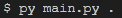

# UnRecurZipper

simple recursive unzipper

## Prerequesites
<a href="https://realpython.com/installing-python/">Python</a>

## How to use it
To use this recursive unzipper, just go into its root folder then open a terminal/cmd at its location and then type:

<b>Here we want to begin the process on the root folder of our app</b>
